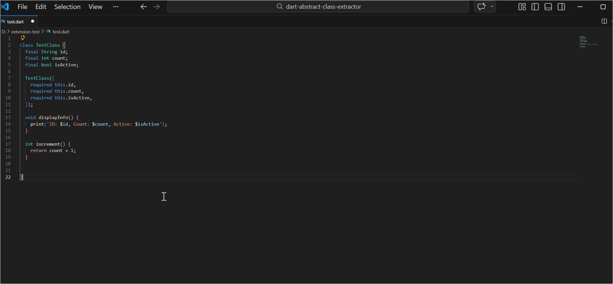

# Dart Abstract Class Extractor

A VS Code extension that automatically converts Dart concrete classes into an abstract interface and a corresponding implementation class — helping you write cleaner, more maintainable Flutter and Dart code following clean architecture principles.




## Features

### Convert Any Dart Class in Seconds

Select any Dart class, run the command, and the extension generates:

- An **abstract interface class** (`IClassName`) with getters for all public properties and abstract method signatures
- A **concrete implementation class** (`ClassNameImpl`) that implements the interface, preserving all original method bodies

**How to use:**

**Option A — Quick Fix:**

1. Open a `.dart` file in VS Code
2. Highlight the class name or anywhere inside the class
3. Press `Ctrl+.` (`Cmd+.` on macOS) to open the Quick Fix menu
4. Select **`Convert to Abstract Class`**

**Option B — Command Palette:**

1. Open a `.dart` file in VS Code
2. Place your cursor inside the class you want to convert
3. Open the Command Palette (`Cmd+Shift+P` / `Ctrl+Shift+P`)
4. Run **`Dart: Convert to Abstract Class`**
5. The generated interface and implementation are inserted directly into your editor

**Example — input:**

```dart
class UserRepository {
  final String baseUrl;

  UserRepository({required this.baseUrl});

  Future<User> getUser(String id) async {
    final response = await http.get('$baseUrl/users/$id');
    return User.fromJson(response.body);
  }

  Future<void> deleteUser(String id) async {
    await http.delete('$baseUrl/users/$id');
  }
}
```

**Example — output:**

```dart
abstract class IUserRepository {
  String get baseUrl;

  Future<User> getUser(String id);
  Future<void> deleteUser(String id);
}

class UserRepositoryImpl implements IUserRepository {
  @override
  final String baseUrl;

  UserRepositoryImpl({required this.baseUrl});

  @override
  Future<User> getUser(String id) async {
    final response = await http.get('$baseUrl/users/$id');
    return User.fromJson(response.body);
  }

  @override
  Future<void> deleteUser(String id) async {
    await http.delete('$baseUrl/users/$id');
  }
}
```

### What Gets Extracted

- ✅ Public properties → abstract getters in the interface
- ✅ Public methods → abstract signatures in the interface
- ✅ Original method bodies preserved in the implementation
- ✅ `@override` annotations added automatically
- ✅ Constructor generated from properties
- ✅ Private members (`_`) are correctly excluded from the interface

## Requirements

- VS Code `^1.109.0`
- A Dart or Flutter project (the extension activates automatically on `.dart` files)
- No additional dependencies or SDK setup required — the extension works purely with source text

## Extension Settings

This extension contributes the following settings, accessible via **File → Preferences → Settings** and searching for `Dart Abstract Class Extractor`:

| Setting                                           | Default  | Description                                                                                           |
| ------------------------------------------------- | -------- | ----------------------------------------------------------------------------------------------------- |
| `dartAbstractClassExtractor.interfacePrefix`      | `"I"`    | Prefix applied to the generated interface name. For example `"I"` produces `IUserService`.            |
| `dartAbstractClassExtractor.implementationSuffix` | `"Impl"` | Suffix applied to the generated implementation name. For example `"Impl"` produces `UserServiceImpl`. |

**Example — custom naming:**

If you prefer a different convention, such as `Abstract` prefix and `Service` suffix:

```json
// settings.json
{
  "dartAbstractClassExtractor.interfacePrefix": "Abstract",
  "dartAbstractClassExtractor.implementationSuffix": "Service"
}
```

This would generate `AbstractUserRepository` and `UserRepositoryService` instead of the defaults.

## Known Issues

- Mixins and `extends` relationships are not carried over to the generated classes — the output focuses on the interface contract only

## Release Notes

### 0.5.1

Fixed a directory path issue on macOS — the extension was incorrectly resolving paths in certain directory configurations, causing failures when the workspace or binary path contained spaces or symlinks. Path resolution is now handled correctly across all standard macOS directory structures. No changes to functionality.

### 0.4.1

Fixed Windows compatibility — `ast_extractor.exe` previously failed on some Windows machines due to a binary architecture mismatch. The extension now bundles separate platform-specific binaries for Windows and macOS, and automatically selects the correct one at runtime. No changes to functionality.

### 0.3.0

Improved distribution — switched to a compiled standalone executable for AST extraction. Users no longer need the Dart SDK installed to run the extension. `ast_extractor` is now bundled directly with the extension and maintains full support for fields, getters, methods, constructors, async/stream functions, and nested generics.

### 0.2.0

Major update — migrated parsing from TypeScript + regex to the Dart Analyzer AST for significantly more accurate and stable results. Adds getter generation for fields and computed properties, `@override` annotations and constructor initialization in implementation classes, and full support for async methods, streams, and nested generics.

### 0.1.0

Initial release — convert concrete Dart classes to an abstract interface and implementation, preserving method bodies, supporting block-body and arrow-function methods, and automatically excluding private members.

## Development

### Running Tests

```bash
npm run compile
npm test
```

### CI

All pull requests to `main` must pass the test suite before merging. The CI pipeline:

1. Compiles the Dart AST extractor binary on Windows and macOS
2. Runs the full TypeScript test suite against the compiled binary
